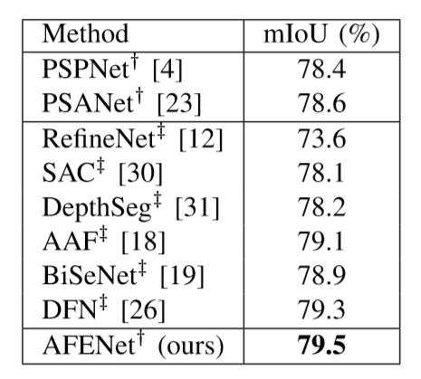
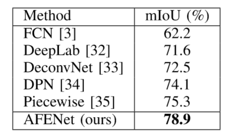

# Adaptive Feature Enhancement Network for Semantic Segmentation


## Abstract
Semantic segmentation is a fundamental and challenging problem in computer vision. Recent studies attempt to integrate feature information of different depths to improve the performance of segmentation tasks, and a few of them enhance the features before fusion. However, which areas of the feature should be strengthened and how to strengthen are still inconclusive. Therefore, in this work we propose an Adaptive Feature Enhancement Module (AFEM) that utilizes high-level features to adaptively enhance the key areas of low-level features. Meanwhile, an Adaptive Feature Enhancement Network (AFENet) is designed with AFEM to combine all the enhanced features. The proposed method is validated on representative semantic segmentation datasets, Cityscapes and PASCAL VOC 2012. In particular, 79.5% mIoU on the Cityscapes testing set is achieved without using fine-val data, which is 1.1% higher than the baseline network and the model size is smaller.

## Performances


### On Cityscapes


### On PASCAL VOC 2012


## Models
The weight of the model is under directory [save_models/cityscapes](save_models/cityscapes/).
### Environment
- torch           1.1.0
- torchvision     0.3.0
- numpy           1.17.1
- opencv-python   4.1.1.26
- Pillow          6.1.0

# Training and Testing
**Train:**
##### 1. train with Cityscapes
- ```python train.py```

##### 2. train with PASCAL VOC 2012
- ```python train_for_voc.py```

**Test:**
##### 1. test with Cityscapes 
- ```python validate.py```

##### 2. generate the results of single scale or multi-scale inference on the testing set
- ```python generate_test_result.py```
- ```python generate_result_for_voc.py```

##### 3.test with an image 
- ```python test_with_an_image.py```

-------------------------------------------------------------------
* Note: Only the parameters of args need to be modified in the these files.


